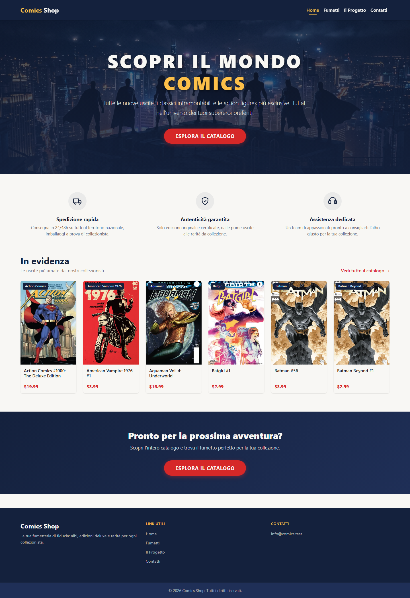
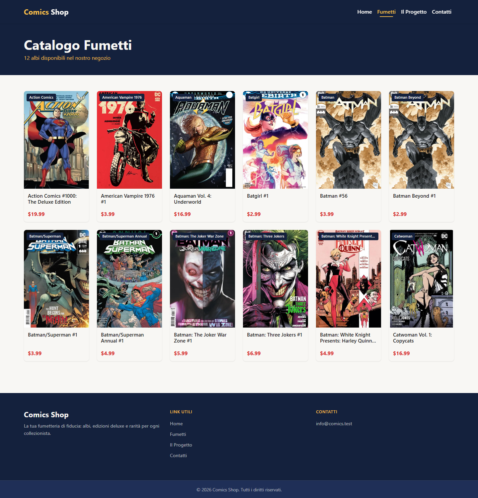
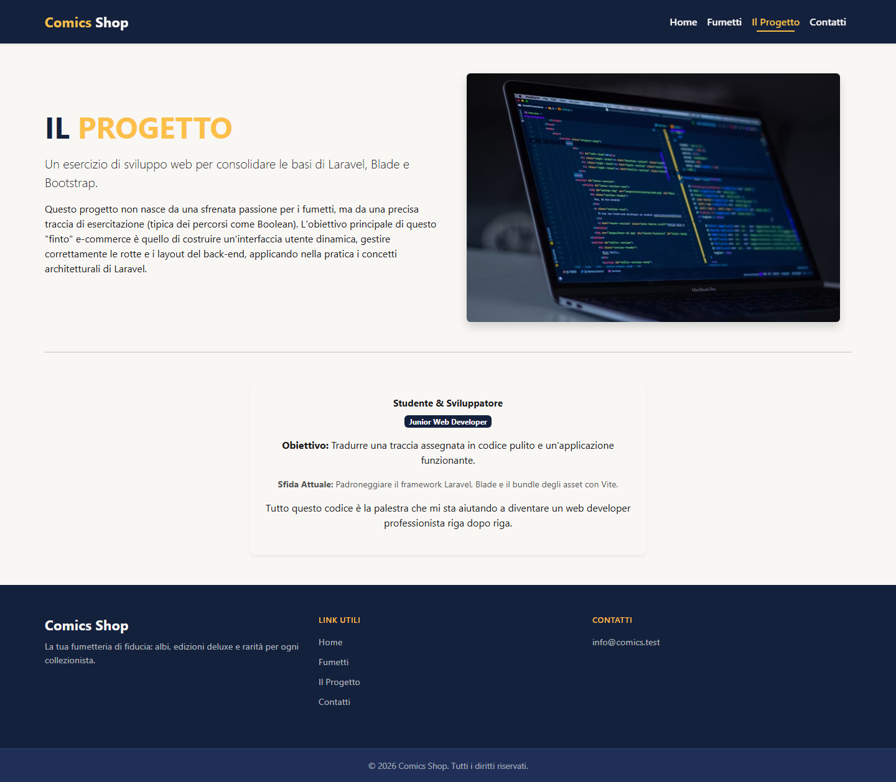
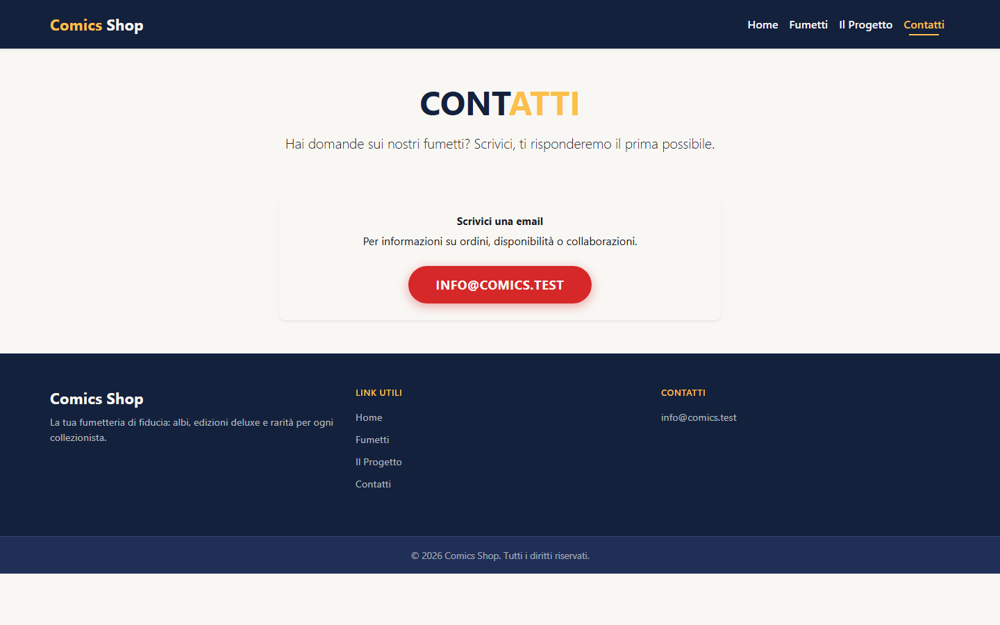

# Laravel Comics

Progetto di esercizio per imparare l'uso dei layout in Laravel: creazione di una struttura condivisa tra le pagine tramite Blade, inclusione di header e footer come partial, lettura di dati statici da un file di configurazione e composizione della UI tramite componenti riutilizzabili.

## Obiettivi dell'esercizio

- Creare un nuovo progetto Laravel
- Definire un layout comune (`head`, `body`, ...) da condividere tra tutte le pagine, includendo header e footer tramite partial
- Creare una rotta che recupera la lista dei fumetti dal file `config/comics.php` e la mostra a schermo
- Bonus 1: creare più pagine istituzionali che condividono lo stesso layout
- Bonus 2: creare uno o più componenti Blade da riutilizzare tra le varie pagine

## Struttura delle pagine

| Rotta          | Nome rotta    | View                       | Descrizione                                |
| -------------- | ------------- | -------------------------- | ------------------------------------------- |
| `/`            | `home`        | `home.blade.php`           | Homepage del progetto                       |
| `/fumetti`     | `fumetti`     | `fumetti/index.blade.php`  | Elenco dei fumetti da `config/comics.php`   |
| `/il-progetto` | `il-progetto` | `about.blade.php`          | Descrizione dell'esercizio                  |
| `/contatti`    | `contatti`    | `contact.blade.php`        | Pagina contatti                             |

Le rotte sono definite in `routes/web.php`. Ogni pagina estende il layout comune `resources/views/layouts/app.blade.php`, che include i partial `resources/views/partials/header.blade.php` e `resources/views/partials/footer.blade.php`.

I fumetti sono definiti come array statico in `config/comics.php` e vengono renderizzati nella pagina `/fumetti` tramite il componente Blade `resources/views/components/comic-card.blade.php`.

### Struttura dei file principali

```
laravel-comics/
├── config/
│   └── comics.php
├── docs/
│   └── screenshots/
│       ├── home.png
│       ├── fumetti.png
│       ├── il-progetto.png
│       └── contatti.png
├── resources/
│   ├── sass/
│   │   ├── _variables.scss
│   │   └── app.scss
│   └── views/
│       ├── home.blade.php
│       ├── about.blade.php
│       ├── contact.blade.php
│       ├── fumetti/
│       │   └── index.blade.php
│       ├── layouts/
│       │   └── app.blade.php
│       ├── partials/
│       │   ├── header.blade.php
│       │   ├── footer.blade.php
│       │   └── jumbotron.blade.php
│       └── components/
│           └── comic-card.blade.php
└── routes/
    └── web.php
```

| File | Ruolo |
|---|---|
| `web.php` | Definisce le rotte come closure, ognuna ritorna la view della pagina corrispondente |
| `comics.php` | Array statico con i dati dei fumetti, letto tramite `config('comics')` |
| `app.blade.php` (layout) | Layout comune con `head`, `@vite` e gli `@include` di header/footer |
| `header.blade.php` / `footer.blade.php` | Partial condivisi tra tutte le pagine |
| `jumbotron.blade.php` | Partial riutilizzabile per le sezioni hero delle pagine |
| `fumetti/index.blade.php` | Estende il layout e itera i fumetti da `config('comics')` renderizzando `<x-comic-card>` |
| `comic-card.blade.php` | Componente Blade per la singola card fumetto |
| `_variables.scss` | Variabili Bootstrap personalizzate (colori, font, ecc.) |

## Screenshot

| Home | Fumetti |
| --- | --- |
|  |  |

| Il Progetto | Contatti |
| --- | --- |
|  |  |

## Come avviare il progetto

```
composer install
npm install
cp .env.example .env
php artisan key:generate
npm run dev
php artisan serve
```

L'app sarà disponibile su http://localhost:8000.

## Tecnologie

- Laravel 12
- Blade templating (layout, partial, componenti)
- Bootstrap 5 (sorgente Sass, variabili personalizzate in `resources/sass/_variables.scss`)
- Sass
- Vite
